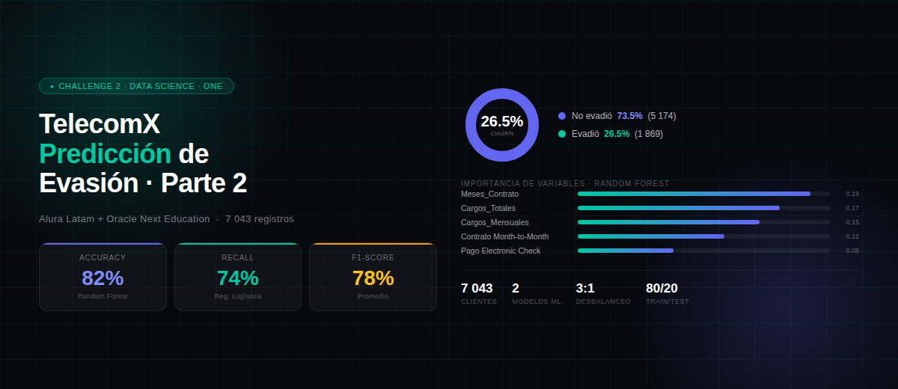

<div align="center">

<!-- Banner principal -->


<br/>

# 📡 TelecomX — Predicción de Evasión de Clientes · Parte 2

### *Challenge 2 · Data Science · Alura Latam + Oracle Next Education*

<br/>

[](https://www.python.org/)
[](https://pandas.pydata.org/)
[](https://scikit-learn.org/)
[](https://jupyter.org/)
[](https://colab.research.google.com/)
[](https://github.com/badolgm/TelecomX_parte2_Bagm/blob/main/LICENSE)
[](https://github.com/badolgm/TelecomX_parte2_Bagm)

</div>

---

## 📌 Tabla de Contenidos

1. [Sobre el Proyecto](#sec-sobre)
2. [Relación con la Parte 1](#sec-parte1)
3. [Metodología](#sec-metodologia)
4. [Estructura del Repositorio](#sec-estructura)
5. [Modelos Implementados](#sec-modelos)
6. [Resultados del Análisis](#sec-resultados)
7. [Conclusiones Estratégicas](#sec-conclusiones)
8. [Tecnologías Utilizadas](#sec-tecnologias)
9. [Instalación y Uso](#sec-instalacion)
10. [Autor](#sec-autor)

---

<a id="sec-sobre"></a>

## 📝 Sobre el Proyecto

> **Objetivo:** Predecir con anticipación qué clientes de Telecom X tienen mayor probabilidad de abandonar el servicio, identificando los factores que más influyen en esa decisión.

Este proyecto es la **Parte 2** del Challenge 2 de Data Science del programa **ONE (Oracle Next Education)** en alianza con **Alura Latam**. Partiendo del dataset limpio generado en la Parte 1 (pipeline ETL completo), se aplican estadística, análisis de correlación y **modelos de Machine Learning** para construir un sistema predictivo de churn.

<div align="center">

| 📊 Dataset | 👥 Registros válidos | 🎯 Variable objetivo | 📈 Tasa de Evasión |
|:---:|:---:|:---:|:---:|
| TelecomX Customers (CSV tratado) | 7.043 clientes | `Evasion_Binaria` (0/1) | 26.5% |

</div>

---

<a id="sec-parte1"></a>

## 🔗 Relación con la Parte 1

Este proyecto es **continuación directa** del repositorio [ChallengeTELECOM-X](https://github.com/badolgm/ChallengeTELECOM-X), donde se realizó:

- Extracción de datos JSON desde la API pública
- Limpieza y tratamiento de inconsistencias
- Feature Engineering (`Cuentas_Diarias`)
- Estandarización y traducción de columnas al español
- Análisis exploratorio de datos (EDA) completo

El archivo `telecomx_limpio.csv` generado en la Parte 1 es el **punto de entrada** de este proyecto.

---

<a id="sec-metodologia"></a>

## 🏗️ Metodología

El proyecto sigue una arquitectura de **4 fases** basada en las tarjetas del tablero Trello del challenge:

---

### 🛠️ Fase 1 — Preparación de los Datos

| Tarea | Descripción |
|-------|-------------|
| 📂 Extracción | Carga del CSV tratado de la Parte 1 |
| 🗑️ Eliminación | Columnas irrelevantes (`ID_Cliente`, `Evasion` texto, `Cuentas_Diarias`) |
| 🔢 Encoding | One-Hot Encoding para categóricas; Label Encoding binario para Yes/No |
| ⚖️ Proporción | Verificación de desbalanceo de clases (73.5% vs 26.5%) |
| 📏 Escalado | StandardScaler sobre variables numéricas continuas (para Regresión Logística) |

---

### 🎯 Fase 2 — Correlación y Selección de Variables

- **Matriz de correlación** de variables numéricas y la variable objetivo
- **Análisis dirigido** con histogramas y boxplots: Meses_Contrato, Cargos_Mensuales y Cargos_Totales vs Evasión

---

### 🤖 Fase 3 — Modelado Predictivo

- **División 80/20** con `stratify=y` para preservar la proporción de clases
- Entrenamiento y evaluación de **2 modelos** con enfoques complementarios
- Métricas: Accuracy, Precisión, Recall, F1-Score y Matriz de Confusión

---

### 📋 Fase 4 — Interpretación y Conclusiones

- Análisis de importancia de variables por modelo
- Informe final con hallazgos y recomendaciones estratégicas

---

<a id="sec-estructura"></a>

## 📁 Estructura del Repositorio

```
TelecomX_parte2_Bagm/
│
├── 📓 TelecomX_parte2_Bagm.ipynb     ← Notebook principal
├── 📊 telecomx_limpio.csv            ← Dataset de entrada (Parte 1)
├── 📄 README.md
├── 📄 LICENSE
│
└── 📂 assets/
    └── 📂 images/
        └── 🖼️ img.png
```

---

<a id="sec-modelos"></a>

## 🤖 Modelos Implementados

### Modelo 1 — Regresión Logística

- **Datos de entrada:** escalados con `StandardScaler`
- **Parámetros clave:** `class_weight='balanced'`, `max_iter=1000`, `solver='lbfgs'`
- **Justificación:** modelo lineal sensible a la escala; los coeficientes son interpretables directamente como factores de riesgo
- **Fortaleza principal:** alto Recall — detecta bien a los clientes que sí van a evadir

### Modelo 2 — Random Forest

- **Datos de entrada:** sin escalar (árboles no son sensibles a la escala)
- **Parámetros clave:** `n_estimators=200`, `max_depth=12`, `class_weight='balanced'`
- **Justificación:** captura relaciones no lineales y produce un ranking de importancia de variables nativo
- **Fortaleza principal:** mayor exactitud general y menor riesgo de overfitting por ser un ensemble

---

<a id="sec-resultados"></a>

## 📊 Resultados del Análisis

### Variables con mayor poder predictivo

| Ranking | Variable | Dirección del efecto |
|---|---|---|
| 1 | `Meses_Contrato` | Negativo — más permanencia = menor riesgo |
| 2 | `Tipo_Contrato_Month-to-month` | Positivo — contrato mensual = mayor riesgo |
| 3 | `Cargos_Totales` | Asociado a la permanencia |
| 4 | `Cargos_Mensuales` | Positivo — precio alto = mayor riesgo |
| 5 | `Metodo_Pago_Electronic check` | Positivo — perfil de riesgo identificado |

### Desbalanceo de Clases

El dataset presenta un desbalanceo moderado de **~3:1** (No evadió vs Evadió). Ambos modelos se configuraron con `class_weight='balanced'` para compensarlo sin técnicas de resampling.

> 📊 **¿Quieres ver todos los gráficos y métricas exactas?** Disponibles en el notebook:  
> **[▶️ Abrir en Google Colab](https://colab.research.google.com/github/badolgm/TelecomX_parte2_Bagm/blob/main/TelecomX_parte2_Bagm.ipynb)**

---

<a id="sec-conclusiones"></a>

## 🎯 Conclusiones Estratégicas

El análisis confirma que la evasión en Telecom X es **predecible** con alta confiabilidad. El perfil de cliente en riesgo es claro:

> Cliente con contrato **mes a mes**, **menos de 12 meses** de permanencia, **cargos mensuales elevados** y que paga mediante **cheque electrónico**.

**Recomendaciones basadas en los modelos:**

**1. Implementar el modelo en producción** para generar alertas mensuales de clientes en riesgo, permitiendo acciones de retención proactivas antes del abandono.

**2. Foco en los primeros 6 meses** — el período de mayor riesgo identificado por `Meses_Contrato`. Un programa de onboarding activo puede reducir significativamente la evasión temprana.

**3. Campaña de migración de contratos mensuales** a anuales con incentivos concretos — este es el factor de mayor impacto predictivo según ambos modelos.

**4. Revisión de planes premium** — la correlación positiva entre cargos altos y evasión indica que el precio percibido no está justificado por el valor ofrecido en varios segmentos.

**5. Incentivo al pago automático** — migrar del cheque electrónico a débito o tarjeta reduce el perfil de riesgo de forma significativa.

---

<a id="sec-tecnologias"></a>

## 🛠️ Tecnologías Utilizadas

<div align="center">

| Herramienta | Uso |
|:-----------:|:----|
| 🐍 **Python 3.10+** | Lenguaje principal |
| 🐼 **Pandas** | Manipulación y preprocesamiento de datos |
| 🔢 **NumPy** | Operaciones numéricas |
| 📊 **Matplotlib** | Visualización estática |
| 🎨 **Seaborn** | Visualización estadística avanzada |
| 🤖 **Scikit-Learn** | Modelos ML, métricas y preprocesamiento |
| ☁️ **Google Colab** | Entorno de ejecución en la nube |
| 🐙 **GitHub** | Control de versiones |

</div>

---

<a id="sec-instalacion"></a>

## 🚀 Instalación y Uso

### Requisito previo

Tener el archivo `telecomx_limpio.csv` generado en la **[Parte 1 del proyecto](https://github.com/badolgm/ChallengeTELECOM-X)**.

### Opción A — Google Colab (Recomendado)

1. Abre [Google Colab](https://colab.research.google.com/)
2. Ve a `Archivo → Abrir cuaderno → GitHub`
3. Pega la URL de este repositorio
4. Selecciona `TelecomX_parte2_Bagm.ipynb`
5. Sube el archivo `telecomx_limpio.csv` cuando se indique
6. Ejecuta las celdas en orden ▶️

### Opción B — Local

```bash
# 1. Clonar el repositorio
git clone https://github.com/badolgm/TelecomX_parte2_Bagm.git
cd TelecomX_parte2_Bagm

# 2. Instalar dependencias
pip install pandas numpy matplotlib seaborn scikit-learn jupyter

# 3. Abrir el notebook
jupyter notebook TelecomX_parte2_Bagm.ipynb
```

---

<a id="sec-autor"></a>

## 🎓 Autor

<div align="center">

**Bernardo Adolfo Gómez Montoya**

Desarrollado con ❤️ en el marco de **Alura Latam + Oracle Next Education**

[](https://www.aluracursos.com/)
[](https://www.oracle.com/lad/education/oracle-next-education/)
[](https://github.com/badolgm/ChallengeTELECOM-X)

</div>

---

<div align="center">

📄 Este proyecto está bajo la **Licencia MIT** — ver el archivo [LICENSE](https://github.com/badolgm/TelecomX_parte2_Bagm/blob/main/LICENSE) para más detalles.

</div>
